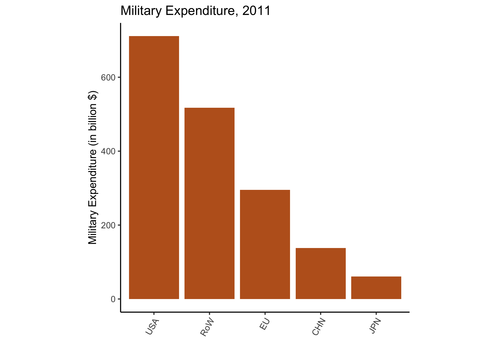
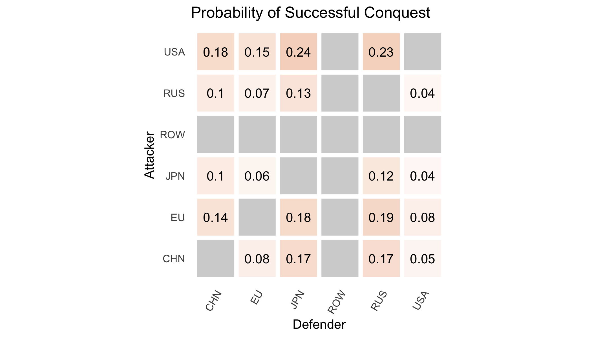
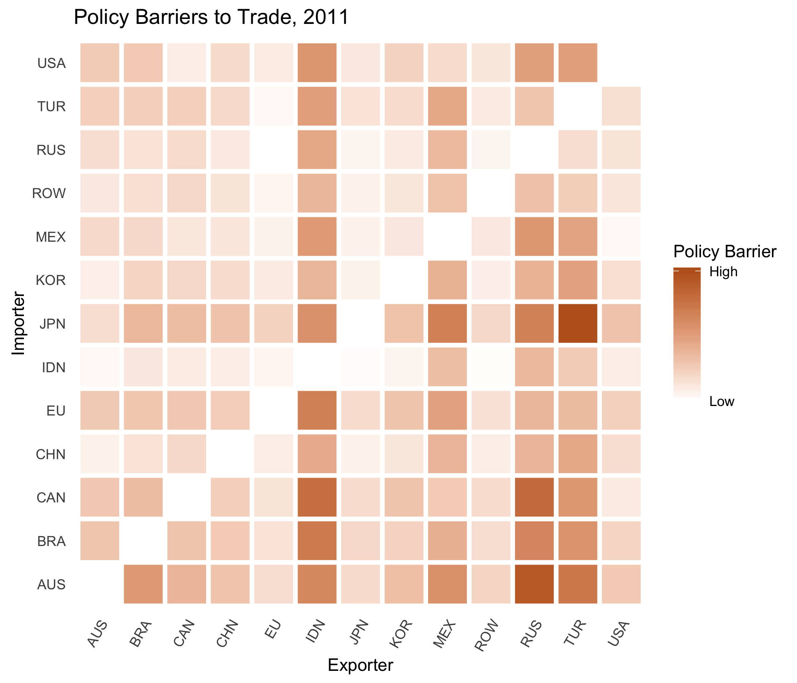

\newpage

# Introduction

Military power holds a central position in international relations (IR) theory. Governments exist in a state of anarchy — there is no world authority tasked with preventing the use of violence in settling policies disputes between them. As a result, powerful governments can employ force against others to secure more favorable policy outcomes. This does not necessarily imply that international relations are uniquely violent, however. Threatened governments can adjust their policy choices to accommodate the interests of the powerful, avoiding costly conflict [@Brito1985; @Fearon1995]. This setting raises an inference problem — do observed policies reflect the preferences of the governmnets that adopted them, or the military constraints of the anarchic international system?

In this paper, I propose and implement a method to assess the effect of military power on trade policy choices. Trade is a natural issue area in which undertake such an investigation. For a variety of reasons, governments' endeavor to protect their home market to some extent. Governments also seek access to foreign markets [@Grossman2016]. These preferences put governments into conflict with one another -- each would like to erect some barriers to imports while dismantling barriers to trade abroad. Given dictatorial power, governments would protect their home market and enforce openness elsewhere. Moreover, aggregate policy-induced trade frictions are large [@Cooley2019b] and have large effects on the distribution and level of welfare within and across countries [@Autor2013; @Costinot2015; @Goldberg2016]. These effects may be particularly salient for politically influential groups [@Grossman1994; @Osgood2017]. Governments therefore have incentives to use force to shape trade policy abroad to their liking. Historically, they have been willing to fight wars to realize such goals [@Findlay2007].

Assessing the effect of military power on trade policy requires imagining what policy choices governments would have made in the absence of coercion. In a coercion-free world, policies reflect preferences. If we observe policies, we can learn something about the preferences of the actors that adopted them. When coercion is possible, however, weaker governments must consider the effect of their policy choices on the powerful. If a particular policy choice harms a threatening government enough, it can choose to impose an alternative policy by force. Recognizing this threat, weaker governments adjust their policies to avoid war. In an anarchic world, policies may be determined by both power and preferences.  

I proceed in three steps to untangle power and preferences as determinants of trade policies. First, I model a coercive international political economy in which governments propose trade policies, observe others proposals, and choose whether or not to fight wars in bids to modify these. The model's equilibrium depends on a vector of parameters governing governments' preferences for protectionism and the effectiveness of military coercion. I then estimate these parameters by minimizing the distance between the model's predictions and observed policies. Finally, I answer the question posed here: how does military coercion affect trade policy? With estimates for the model's parameters in hand, this question can be answered by a simple counterfactual experiment — eliminate governments' military capacity, and recalculate the model's equilibrium. The difference between counterfactual equilibrium policies and the factual policies represents the net effect of military coercion on trade policy.

Within the coercive international political economy, governments choose trade policies to maximize a combination of consumer welfare and trade policy rents. Each government's trade policy is a set of taxes, one for each importing country, imposed on imports. Notably, trade policies can be discriminatory, affecting certain source countries disproportionately. A model of the international economy connects trade policy choices to consumer welfare and trade flows, which determine the magnitude of rents available to governments.^[The model of the international economy is a variant of the workhorse model of @Eaton2002. @Costinot2015 study a broader class of structural gravity models that connect trade frictions (such as trade policy) to trade and welfare outcomes.] Each government is endowed with military capacity which can be employed in wars against other governments. Winning a war allows the victor to choose the trade policy of the defeated government. Counterfactual wars constrain threatened governments and affect their trade policy choices. The effectiveness of coercion, or governments' ability to project power, depends on the geographic distance between potential adversaries.

Governments' ideal policies depend on their relative preference for consumer welfare versus rents. Governments' ability to influence the choices of others depends on the effectiveness of power projection over geographic space and the returns to military power preponderance. Preferences and the shadow of power are difficult to measure. However, researchers do observe proxies of governments' total military strength (military spending) and their trade policy choices.^[I use data on aggregate directed trade policy distoritions from @Cooley2019b, a companion paper to this study. These data are discussed in more detail below.] The model maps military strength and power and preference parameters to policy choices. With information about total military strength, I show that the model can be inverted to recover parameters that best explain governments' policy choices. 

Within-country variation in trade policy identifies the model. Consider the ideal set of trade policies of a government whose preferences are known. The policies that achieve this objective can be readily calculated given knowledge of parameters governing international economic relations. Policies adopted toward imports from countries that pose no military threat will reflect this objective. Conversely, the imports of threatening countries will encounter lower barriers to trade, in order to satisfy the threatener's war constraint. This favoritism is informative about the effectiveness of military threats. The level of barriers toward non-threatening countries is informative about the government's preferences. Differential responses to the same level of threat from different geographic locations identifies parameters governing the effectiveness of power projection across space.

The identified model enables two classes of counterfactuals. First, it allows me to quantify the "shadow of power" by comparing factual policies to those that would prevail if governments' counterfactually possessed zero military capability. These policies can then be fed into the model of the international economy to calculate the effect on trade flows, prices, and wages around the world. Would different trade blocs emerge in a coercion-free world? Which governments would benefit the most? In the model, consumers benefit from the liberalizing effect of foreign military coercion [@Antras2011]. How large are these benefits? Whose citizens benefit the most from international power politics? How would relative changes to U.S. and Chinese military strength affect the international economy?

The model also allows me to examine how domestic political economic changes (changes to government preferences) affect the salience of military coercion. Governments that value the welfare of consumers prefer to adopt lower barriers to trade. The returns to coercing these governments are smaller, because their ideal policies impose relatively small externalities on potential threatening governments. Military coercion plays a smaller role in influencing trade policy when governments are relatively liberal. Domestic political institutions are believed to effect trade policy preferences [@Rodrik1995; @Milner1999; @Milner2005]. The model facilitates exploration of how domestic political change affects the quality of international relations and governments' propensity to threaten, display, and use military force against one another. 

Estimating the model and conducting the subsequent counterfactual exercises require knowledge of governments' trade policies, disaggregated at the trade partner level. While detailed data on a particular policy instrument (tariffs) are available to researchers, these are but one barrier governments can use to influence the flow of trade. In a companion paper [@Cooley2019b], I show that cross-national prices, trade flows, and freight costs are jointly sufficient statistics for the magnitude of aggregate policy barriers trade, given a structural model of the international economy [@Head2014; @Costinot2015]. I employ these measures of trade policy in this paper and use an identical model of the international economy to connect trade policy changes to international economic outputs.

The method produces a matrix of trade barriers, in which the $i$, $j$th entry is the magnitude of policy barriers to trade an importing country $i$ imposes on goods from an exporting country $j$. In 2011, the estimated barriers were large, equivalent to a 67 percent import tariff on average.^[These results and the calibration choices that produce this value are discussed in more detail in Appendix B.] They also reveal substantial trade policy discrimination, providing necessary variation to identify the model considered here.

## Literature

Conflicts of interest and the specter of coercive diplomacy emerge in the model due to governments' protectionist preferences. Trade theory reserves a role for small trade policy distortions for governments that seek to maximize aggregate societal wealth [@Johnson1953; @Broda2008]. Empirically, governments implement larger trade distortions than predicted in theory, however. This regularity motivated the study of the political economics of trade policy. While nearly free trade may be good for a society as a whole, owners of specific factors of production may prefer protectionism. If these groups have better access to the policymaking process, trade policy may be more protectionist than is optimal for society [@Mayer1984; @Rogoswki1987; @Grossman1994]. A family of studies uses these theoretical insights to estimate governments' sensitivity to narrow versus diffuse interests [@Goldberg1999; @Mitra2006; @Gawande2009; @Gawande2012; @Ossa2014; @Gawande2015]. Because these models incorporate no theory of international coercion, these estimates reflect the assumption that policy choices directly reflect preferences.

Fiscal pressures might also drive protectionism. Some governments are constrained in their ability to raise revenue through taxes on domestic economic activities. Tariffs and other trade distortions may substitute as a revenue-raising strategy in these cases [@Rodrik2008; @Queralt2015]. I take no stance on the domestic political origins of protectionist preferences. I induce these by incorporating concern for revenue into the government's objective function (independent of its welfare effects). This leads to a preference for trade barriers higher than what would be optimal for governments that cared only about the welfare of a representative consumer. What is important here is that efforts to achieve this objective impose externalities on foreign governments. 

These externalities motivate the lobbying efforts of domestic special interests and structure international negotiations over trade policy. In contemporary political economic accounts, large and productive firms pressure their own governments to secure market access abroad in order to increase profit opportunities [@Ossa2012; @Osgood2016; @Kim2017]. By contrast, in my model, lower barriers to trade abroad increase wages at home (helping consumers) and stimulate trade (increasing revenue). Therefore, regardless of their relative preference for consumer welfare versus rents, governments prefer to reduce barriers confronting their exports. Modeling government preferences in this manner captures market access incentives tractably while avoiding ascribing a particular domestic political process to their origin.

Because of these preferences for foreign trade liberalization, governments have incentives to influence others' policy choices. Analyzing governments' foreign policy in the 17th and 18th centuries, @Viner1948 concludes "important sources of national wealth...were available...only to countries with the ability to acquire or retain them by means of the possession and readiness to use military strength." Powerful governments established colonies and threatened independent governments in order to shape policy abroad to their liking [@Gallagher1953]. While formal empires died quickly after World War II, softer forms of influence remained. @Lake2013 terms the resulting order a "hierarchy" in which weaker countries exchanged sovereignty for international political order, provided by a hegemonic United States. @Berger2013 show that this hierarchy has not always been benevolent — U.S. political influence was used to open markets abroad, a form of "commercial imperialism." An earlier literature ascribed international economic openness to the presence of such a hegemon [@Krasner1976; @Gilpin1981; @Kindleberger1986]. In conceptualizing openness as a public good, these theories made stark predictions about the distribution of military power and the international economy. In reality, the benefits of changes to trade policy are quite excludable. The model developed here reflects this reality by allowing governments to adopt discriminatory trade policies. Power can therefore be exercised to secure benefits not shared by other governments. The resulting international economic orders defy characterization as "open" or "closed." In a stylized version of the model developed here, I show that latent regime change threats can be used to open foreign markets. Militarily weak countries adopt lower barriers to trade than their powerful counterparts, all else equal [@Cooley2019a]. @Antras2011 consider a similar model in which governments influence elections abroad. Again, this influence has a liberalizing effect on the foreign government's trade policy.

Nevertheless, debate persists about the efficacy of military power in achieving economic benefits [@Mastanduno2009; @Drezner2013; @Bove2014; @Stokes2017]. These studies all confront the inference problem discussed here — does economic policy reflect governments' underlying preferences or the shadow of foreign military power? When redistribution is an alternative to war and bargaining is frictionless, war is not necessary to achieve coercive effects [@Brito1985; @Fearon1995; @Art1996]. I assume that the effectiveness of military coercion depends on the geographic distance between a threatening and defending country. By examining the responsiveness of policy to foreign threats, I can quantify this relationship, providing estimates of the loss of strength gradient discussed in a body of quantitative studies on war and militarized interstate disputes [@Boulding1962; @BuenodeMesquita1980; @Diehl1985; @Lemke1995; @Gartzke2011].

Several studies have examined trade policy bargaining theoretically and empirically. @Grossman1995 extend the protection for sale model to a two-country bargaining setting. @Maggi1999 and @Bagwell1999 focus on the effect of the institutional context in which trade policy negotiations take place, relative to an un-institutionalized baseline. @Ossa2014, @Bagwell2018a and @Bagwell2018b quantify these theories in structural models. Of course, the continued functioning of international institutions requires either a) that complying with the rules of the institution be incentive compatible for each member state, given others' strategies or b) that an external authority punish deviations from the institutions' rules sufficiently to induce compliance [@Powell1994]. Given the absence of such an external authority and the stark international distributional implications of alternative trade policy regimes, it is natural to consider how the ability to employ military force colors trade policy bargaining. 

Trade and trade policy are often theorized as tools governments can leverage to achieve political objectives [@Hirschman1945; @Gowa1993; @Martin2012; @Seitz2015].  Yet, affecting trade policy and concomitant prices, wages, and trade flows is also a central government objective in international relations. Moreover, the political objectives that ostensibly motivate governments in these "trade as means" models are loosely defined (e.g. "security") and themselves means to achieving other ends. Studying trade policy as a strategic end allows the analyst to leverage a family of empirical methods in international economics to construct counterfactual trade regimes and analyze their welfare implications [@Eaton2002; @Head2014; @Costinot2015; @Ossa2016]. Government objectives can be defined flexibly as a function of general equilibrium outputs (prices, wages, revenues).

A handful of other theoretical studies examine how power affects exchange in market environments [@Skaperdas2001; @Piccione2007; @Garfinkel2011; @Carroll2018]. Where property rights are assumed in classical models of the economy, these authors consider exchange and violence as coequal means to acquire goods from others. I instead direct attention to coercive bargaining over endogenous trade frictions (trade policy). These in turn affect the distribution of goods and welfare in the international economy.

# Model

There are $N$ governments, indexed $i \in \left\{ 1, ..., N \right\}$. Governments choose trade policies $\bm{\tau}_i = \left( \tau_{i1}, ..., \tau_{iN} \right) \in [1, \bar{\tau}]^N$ which affect their welfare indirectly through changes in the international economy.^[$\bar{\tau}$ is an arbitarily large but finite value sufficient to shut down trade between any pair of countries.] An entry of the trade policy vector, $\tau_{ij}$ is the cost country $i$ imposes on imports from $j$.^[Costs enter in an "iceberg" fashion, and I normalize $\tau_{ii} = 1$. Then, if the price of a good in country $j$ is $p_{jj}$, its cost (less freight) in country $i$ is $\tau_{ij} p_{jj}$. The ad valorem tariff equivalent of the trade policy is $t_{ij} = \tau_{ij} - 1$. I employ structural estimates of these costs from @Cooley2019b to estimate the model, which are described in more detail in Appendix A.] The economy, detailed in Appendix A, can be succinctly characterized by a function $h: \bm{\tau} \rightarrow \mathbb{R}_{++}^N$ mapping trade policies to wages in each country, denoted $\bm{w} = \left( w_1, ..., w_N \right)$. These in turn determine trade flows between pairs of countries and price levels around the world.^[The economy is a variant of the workhorse model of @Eaton2002.]

Throughout, I will use $\bm{\theta}_m$ to denote the vector of all parameters to be estimated and $\bm{Z}$ to denote the vector of all data observed by the researcher. $\bm{\theta}_h$ denotes parameters associated with the economy, $h$, which will be calibrated. I will explicate the elements of these vectors in the proceeding sections and the Appendix.

Government welfare depends on these general equilibrium responses to trade policy choices. Governments value the welfare of a representative consumer that resides within each country and rents accrued through trade policy distortions (tariff revenues). These can be computed given knowledge of the general equilibrium function $h(\bm{\tau})$. I assume these elements are complements in the production of government utility, formally,
\begin{equation} \label{eq:G}
G_i(\bm{\tau}; b_i) = V_i \left( h(\bm{\tau}) \right) r_i \left( h(\bm{\tau}; v_i) \right)
\end{equation}
where $V_i(h(\bm{\tau}))$ is consumer welfare, $r_i(h(\bm{\tau}), v_i)$ are tariff revenues, and $v_i \in [1, \infty)$ is a structural parameter that modulates the government's ability to extract trade policy rents from society. Revenues are given by
\begin{equation} \label{eq:r}
r_i(h(\bm{\tau}), v_i) = \sum_j (\tau_{ij} - v_i) X_{ij}(h(\bm{\tau}))
\end{equation}
and $X_{ij}(h(\bm{\tau}))$ are country $i$'s imports from country $j$.^[This object does not correspond empirically to governments' factual tariff revenues, as $\tau_{ij}$ incorporates a larger set of trade policy distortions than tariffs alone. Yet, non-tariff barriers to trade also generate rents that do not accrue directly to the government's accounts (see, for example, @Anderson1992 for the case of quotas). This revenue function is designed to capture this broader set of rents.] When $v_i$ is close to one, small policy distortions are sufficient to generate revenue for the government. Conversely when $v_i$ is high, the government must erect large barriers to trade before revenues begin entering government coffers. Because some revenue is necessary in order to produce government welfare, increasing $v_i$ induces governments' to become more protectionist. This formulation provides substantial flexibility in rationalizing various levels of protectionism, while avoiding assuming specific political economic motivations for its genesis. From the perspective of the governments, rents extracted imports are valued equally, regardless of their source. Ex ante, governments are not discriminatory in their preferences.

Characterizing the theoretical properties of this objective function is challenging due to the network effects inherent in general equilibrium trade models. Suppose $i$ increases barriers to trade with $j$. This affects wages and prices in $j$ and its competitiveness in the world economy. These changes affect its trade with all other countries $k$, which affects their welfare, and so on [@Allen2019]. In order to make progress, I assume that $G_i$ is quasiconcave in $i$'s own policies, which ensures the existence of an unconstrained optimal policy vector and a pure-strategy Nash equilibrium to the simultaneous policy-setting game.^[This property holds in my numerical simulations, but may not hold more generally. The existence of a Nash equilibrium follows from the fixed point theorem of Debreu, Glicksberg, and Fan [@Fudenberg1992 p. 34].]

**Assumption 1**: 
$G_i(\bm{\tau}; b_i)$ is quasiconcave in its own policies, $\tau_{ij} \in [1, \bar{\tau}]$, $j \neq i$.

These optimal policies impose externalities on other governments. By controlling the degree of market access afforded to foreign producers, trade policies affect the wages of foreign workers and the welfare of the governments that represent them. They also partially determine trade flows, which affect other governments' ability to collect rents. In this sense, protectionism is "beggar they neighbor." Governments' joint policy proposals are denoted $\tilde{\bm{\tau}}$.

After trade policies announcements are made, governments decide whether or not they would like to wage war against other governments. Wars are fought in order to impose more favorable trade policies abroad. Each government is endowed with military capacity $M_i$ which can be used in wars with other governments. Wars are offensive and *directed*. Formally, let $\bm{a}_i = \left( a_{i1}, ..., a_{iN} \right)$ denote $i$'s war entry choices, where $a_{ij} \in \left\{ 0 , 1 \right\}$ denotes whether or not $i$ choose to attack $j$.^[Note that this formulation leaves open the possibility that two governments launch directed wars against one another, $a_{ij} = a_{ji} = 1$.] $a_{ii} = 1$ for all $i$ by assumption -- governments always choose to defend themselves.

If $i$ is successful in defending itself against all attackers, its announced policies are implemented. Government $i$ suffers a cost $c_i$ for each war it must fight, accruing total war costs $\sum_{j \neq i} a_{ij} c_i$. Each attacker $j$ also pays $c_j$. When a government $i$ wins a war against $j$, it earns the right to impose free trade on the losing government, setting $\bm{\tau}_j = \left\{ 1, \dots, 1 \right\} = \bm{1}_j$. Substituting these policies into $i$'s utility function gives $G_i(\bm{1}_j; \tilde{\bm{\tau}}_{-j})$ as $i$'s *conquest value* vis-à-vis $j$. Note that I prohibit governments from imposing discriminatory policies on conquered states. Substantively, this assumption reflects the difficulty in enforcing sub-optimal policies on prospective client states, relative to reorienting their political institutions to favor free trade.^[It also substantially eases computational burdens by avoiding re-calculating optimal imposed policies for different values of preference parameters.] This also ensures that the benefits of regime change wars are public. However, it does not guarantee non-discrimination in times of peace. Governments that pose most credible threat of conquest can extract larger policy concessions from their targets in the form of directed trade liberalization. 

Governments' ability to prosecute wars against one another depend on dyadic geographic factors $\bm{W}$, such as geographic distance. For every unit of force $i$ dedicates toward attacking $j$, $\rho_{ji}(\bm{W}_{ji}; \bm{\alpha}) > 0$ units arrive. I normalize $\rho_{jj} = 1$ -- defensive operations do not result in any loss of strength. $\bm{\alpha}$ is a vector of structural parameters governing this relationship to be estimated. I adopt a simple exponential functional form for this function where
\begin{equation} \label{eq:rho}
\rho_{ji}(\bm{W}_{ji}; \bm{\alpha}) = e^{ -\bm{\alpha}^T \bm{W}_{ji} } .
\end{equation}
$\bm{W}_{ji}$ is a vector of dyadic geographic features such as centroid-centroid distance, and $\bm{\alpha}$ parameterizes the effect of these features on power projection capacity.

War outcomes are determined by a contest function
\begin{equation} \label{eq:chi}
\chi_{ij}(\bm{a}) = \frac{ a_{ij} \rho_{ij}(\bm{W}; \bm{\alpha}) M_i }{ \sum_k a_{kj} \rho_{kj}(\bm{W}; \bm{\alpha}) M_k } .
\end{equation}
$\chi_{ij} \in [0, 1]$ is the probability that $i$ is successful in an offensive war against $j$. Note that wars are multilateral and winner-take-all. Many countries can choose to attack $j$, but only one government can win. 

For the moment, fix $a_{jk} = 0$ for all $k \neq i$, $j \neq k$. $i$ is the only government that faces the possibility of attack. Then, all other policy proposal vectors $\tilde{\bm{\tau}}_{-i}$ are implemented with certainty and $i$'s utility as a function of war entry decisions is 
$$
\tilde{G}_i^{\bm{a}}(\bm{a}) = \chi_{ii}(\bm{a}) G_i(\tilde{\bm{\tau}}) + \sum_{j \neq i} \left( \chi_{ji}(\bm{a}) G_i(\bm{1}_i; \tilde{\bm{\tau}}_{-i}) - a_{ji} c_i \right)
$$

Attackers consider the effect of their war entry on the anticipated policy outcome. Now consider an attacker $j$'s war entry decision vis-à-vis a defender $i$, assuming no other country launches a war. Let 
$$
\tilde{\chi}_{ji}(\bm{Z}; \bm{\theta}_m) = \frac{ \rho_{ji}(\bm{W}; \bm{\alpha}) M_j }{ \rho_{ji}(\bm{W}; \bm{\alpha}) M_j + M_i }
$$
denote the probability that $j$ is successful in this contingency.

Government $j$ prefers not to attack $i$ so long as
\begin{equation} \label{eq:AwarConstraint}
G_j(\tilde{\bm{\tau}}) \geq \tilde{\chi}_{ji}(\bm{Z}; \bm{\theta}_m) G_j(\bm{1}_i; \tilde{\bm{\tau}}_{-j}) + \left( 1 - \tilde{\chi}_{ji}(\bm{Z}; \bm{\theta}_m) \right) G_j(\tilde{\bm{\tau}}) - c_j .
\end{equation}

Let $\bm{a}^\star : \tilde{\bm{\tau}} \rightarrow \left\{ 0, 1 \right\}_{N - 1 \times N - 1}$ denote equilibrium war entry decisions as a function of announced policies and $a_{ij}^\star(\tilde{\bm{\tau}})$ denote $i$'s equilibrium decision of whether or not to attack $j$. Governments choose whether or not to enter wars simultaneously. When peace prevails, $a_{ij}^\star(\tilde{\bm{\tau}}) = 0$ for all $i \neq j$. 

To recap, governments make policy announcements, $\tilde{\bm{\tau}}$, and then launch wars $\bm{a}$.  At each stage, actions are taken simultaneously. The solution concept is subgame perfect equilibrium. In Appendix C, I show that there exist peaceful equilibria to the game as long as war costs are large enough (Proposition C1).^[This result mirrors @Fearon1995's proof of the existence of a bargaining range in a unidimensional model. Here, because the governments' objective functions are not necessarily concave, war costs may need to be larger than zero in order to guarantee peace.] I assume the values of $\left\{ c_i \right\}_{ i \in \left\{ 1, \dots, N \right\} }$ are large enough to deliver peace and restrict attention to these equilibria. I can then analyze the subgame consisting policy announcements only, while ensuring that inequality \ref{eq:AwarConstraint} holds for every attacker $k$ and potential target $i$.

Optimal trade policies proposals for $i$ in this case solve
\begin{equation} \label{eq:tauTildeStar}
\begin{split}
\max_{ \tilde{\bm{\tau}}_i } & \quad G_i(\tilde{\bm{\tau}}_i; \tilde{\bm{\tau}}_{-i}) \\
\text{subject to} & \quad G_j(\tilde{\bm{\tau}}) - G_j(\bm{1}_i; \tilde{\bm{\tau}}_{-i}); \tilde{\bm{\tau}}_{-i}) + c \tilde{\chi}_{ji}(\bm{Z}; \bm{\theta}_m)^{-1} \geq 0 \quad \text{for all } j \neq i
\end{split}
\end{equation}
where the constraints can be derived by rearranging \ref{eq:AwarConstraint}. Formulated in this manner, it becomes clear that military allocations affect trade policy through their effect on the $i$'s war constraints. As $M_j$ increases, $\tilde{\chi}_{ji}$ increases as well, tightening the constraint on $i$'s policy choice. Let $\tilde{\bm{\tau}}_i^\star(\tilde{\bm{\tau}}_{-i})$ denote a solution to this problem and $\tilde{\bm{\tau}}^\star$ a Nash equilibrium of the constrained policy announcement game. I refer to this game as $\Gamma^{\bm{\tau}}$.

## Policy Equilibrium in Changes

The equilibrium of the international economy depends on a vector of structural parameters and constants $\bm{\theta}_h$ defined in Appendix A. Computing the equilibrium $h(\bm{\tau}; \bm{\theta}_h)$ requires knowing these values. Researchers have the advantage of observing data related to the equilibrium mapping for one particular $\bm{\tau}$, the factual trade policies. 

The estimation problem can be therefore partially ameliorated by computing the equilibrium in *changes*, relative to a factual baseline. Consider a counterfactual trade policy $\tau_{ij}^\prime$ and its factual analogue $\tau_{ij}$. The counterfactual policy can be written in terms of a proportionate change from the factual policy with $\tau_{ij}^\prime = \hat{\tau}_{ij} \tau_{ij}$ where $\hat{\tau}_{ij} = 1$ when $\tau_{ij}^\prime = \tau_{ij}$. By rearranging the equilibrium conditions, I can solve the economy in changes, replacing $h(\bm{\tau}; \bm{\theta}_h) = \bm{w}$ with $\hat{h}(\hat{\bm{\tau}}; \bm{\theta}_h) = \hat{\bm{w}}$. Counterfactual wages can the be computed as $\bm{w}^\prime = \bm{w} \odot \hat{\bm{w}}$.

This method is detailed in Appendix A. Because structural parameters and unobserved constants do not change across equilibria, parameters that enter multiplicatively drop out of the equations that define this "hat" equilibrium. This allows me to avoid estimating these parameters, while enforcing that the estimated equilibrium is consistent with their values. The methodology, introduced by @Dekle2007, is explicated further in @Costinot2015 and used to study trade policy changes in @Ossa2014 and @Ossa2016.

It is straightforward to extend this methodology to the game studied here. Consider a modification to the policy-setting subgame in which governments propose changes to factual trade policies $\hat{\tilde{\bm{\tau}}}$ and call this game $\Gamma^{\hat{\bm{\tau}}}$. Note that this modification is entirely cosmetic -- the corresponding equilibrium of $\Gamma^{\hat{\bm{\tau}}}$ in levels can be computed by multiplying factual policies by the "hat" equilibrium values ($\tau_{ij}^\prime = \hat{\tau}_{ij} \tau_{ij}$). I can then replace the equilibrium conditions of $\Gamma^{\bm{\tau}}$ with their analogues in changes. Each government's welfare (\ref{eq:G}) in changes is
\begin{equation} \label{eq:Ghat}
\hat{G}_i(\hat{\bm{\tau}}) = \hat{V}_i \left( \hat{h}(\hat{\bm{\tau}}) \right) \hat{r}_i \left( \hat{h}(\hat{\bm{\tau}}), v_i \right) .
\end{equation}

If $i$ loses a war, free trade is imposed, equivalent to $\hat{\bm{\tau}} = bm{\tau}_i^{-1}$ where $\bm{\tau}_i$ are observed policies. By dividing the governments' war constraints (\ref{eq:AwarConstraint}) by their factual welfare $G_j(\bm{\tau})$, their constrained policy announcement problem can be rewritten as the solution to
\begin{equation} \label{eq:tauTildeStarHat}
\begin{split}
\max_{ \hat{\tilde{\bm{\tau}}}_i } & \quad \hat{G}_i(\hat{\tilde{\bm{\tau}}}_i; \hat{\tilde{\bm{\tau}}}_{-i}) \\
\text{subject to} & \quad \hat{G}_j(\hat{\tilde{\bm{\tau}}}) - \hat{G}_j(\bm{\tau}_i^{-1}) + \hat{c} \tilde{\chi}_{ji}(\bm{Z}; \bm{\theta}_m)^{-1} \geq 0 \quad \text{for all } j \neq i
\end{split}
\end{equation}
where
$$
\hat{c} = \frac{c_i}{G_j(\bm{\tau}; b_j)}
$$
is the *share* of factual utility each government pays if a war occurs. Assumption 2 requires that governments pay the same share of their factual utility in any war.^[While not innocuous, this assumption is more tenable than assumption constant absolute costs. It formalizes the idea that larger countries (that collect more rents and have high real incomes than their smaller counterparts) also pay more in military operations. It avoids the complications inherent in the more realistic but less tractable assumption that war costs depend on power ($\tilde{\chi}$).]

**Assumption 2 (Constant Relative War Costs):** 
$\hat{c}_i = \hat{c}$ for all $i$.

$\hat{\tilde{\bm{\tau}}}_i^\star(\hat{\tilde{\bm{\tau}}}_{-i})$ denotes $i$'s best response function and $\hat{\tilde{\bm{\tau}}}^\star$ denotes an equilibrium in changes. 

# Data and Calibration of Economy

I estimate the model on a set of 6 governments in the year 2011.^[Focusing on a small set of governments is necessary for computational tractability. However, the largest countries (by GDP) are the most attractive targets for coercion, as changes to their trade policies return the largest welfare gains, regardless of whether the coercer is a rent-maximizer or welfare-maximizer. The estimated model is therefore more useful in understanding "great power politics," rather than smaller political-economic conflicts of interest.] These governments are listed in Table \ref{tab:v_estsT}. I aggregate all European Union governments into a single entity and collapse all countries not included in the analysis into a "Rest of World" (ROW) aggregate.^[Such an aggregation is necessary in order to calculate fully general equilibrium effects of counterfactual trade policies. However, I prohibit other countries from invading ROW and likewise prohibit ROW from invading others. This ensures that estimates of military parameters depend almost entirely on interactions between countries within my sample.] Non-ROW countries make up  percent of world GDP.

Solving the economy in changes for a set of $\hat{\bm{\tau}}$ requires values for a vector of economic parameters $\bm{\theta}_h$ and data on trade flows, policy barriers, and and national accounts. I discuss how I calibrate the economy and the data sources used to do so in Appendix B. There, I also report the magnitude of policy barrier estimates $\tilde{\bm{\tau}}$ from @Cooley2019b. With $\hat{h}(\hat{\bm{\tau}}; \bm{\theta}_h)$ calibrated, $\hat{G}_i(\hat{\bm{\tau}})$ can be calculated for any set of trade policies and the conquest values can be computed.

With the economy calibrated and policy barrier estimates in hand, I require only a measure of each government's military endowment ($M_i$) and data on dyadic geography ($\bm{W}$). I use [SIPRI](https://www.sipri.org/)'s data on military expenditure to measure governments' military capacity. These values are displayed in Figure \ref{fig:milex}.

Finally, I use data from @Weidmann2010 to calculate centroid-centroid geographic distance between all countries in my sample. I take the natural log of this value to be the only variable affecting power projection capacity in $\bm{W}$. 

# Estimation

The model's equilibrium, $\hat{\tilde{\bm{\tau}}}^\star$ depends on a vector of parameters $\bm{\theta}_m = \left( \bm{b}, \bm{\alpha}, \gamma, \hat{c}, \right)$, as well as the values of the shocks $\left\{ \xi_{ij} \right\}_{i,j \in \left\{ 1, \dots, N \right\}}$ and $\left\{ \epsilon_{ij} \right\}_{i,j \in \left\{ 1, \dots, N \right\}}$. Because I work with an equilibrium in changes, a prediction $\hat{\tilde{\tau}}_{ij}^\star = 1$ is consistent with the data -- the model predicts that in equilibrium, government $i$ would make no changes to its factual trade policy toward $j$. I assume observed $\tilde{\bm{\tau}}^\star$ are measured with error
$$
\tilde{\bm{\tau}}^\star(\bm{\theta}_m) = \tilde{\bm{\tau}} + \bm{\epsilon}
$$
where $\bm{\epsilon}$ is an $N \times N$ matrix with $\epsilon_{ii} = 0$ for all $i$ and $\E[\epsilon_{ij}] = 0$ for all $i \neq j$. Recall that $\tilde{\bm{\tau}}^\star$ can be reconstructed from $\hat{\tilde{\bm{\tau}}}^\star$, the model's equilibrium, by simply multiplying equilibrium policies by factual policies, $\bm{\tau}$.

Following the assumption that measurement error is mean-zero, I seek an estimator that solves
\begin{equation} \label{eq:estimator}
\min_{\bm{\theta}_m} \sum_i \sum_j \epsilon_{ij}(\bm{\theta}_m) .
\end{equation}

Solving this problem presents two computational challenges. First, computing government welfare changes for any given $\hat{\bm{\tau}}$ requires solving system of equations characterizing the equilibrium of the international economy, $\hat{h}(\hat{\bm{\tau}})$. Second, computing $\tilde{\bm{\tau}}^\star(\bm{\theta}_m)$ requires iteratively solving each government's best response problem (\ref{eq:tauTildeStarHat}) until covergence at a Nash equilibrium. I sidestep both of these by recasting the best response problem and estimation problem as mathematical programs with equilibrium constraints (MPECs) [@Su2012; @Ossa2014; @Ossa2016].

To reformulate the best response problem, I consider an equivalent reformulation in which each government chooses trade policies and wages, subject to the additional constraint that chosen wages are consistent with the general equilibrium of the international economy ($\hat{h}(\hat{\tilde{\bm{\tau}}}) = \hat{w}$). Let $\hat{\bm{x}}_i = \left( \hat{\tilde{\bm{\tau}}}_i, \hat{\bm{w}} \right)$ store $i$'s choice variables in this problem. Then, this problem can be rewritten as follows, noting explicitly dependencies on $\bm{\theta}_m$
\begin{equation} \label{eq:tauTildeHatMPEC}
\begin{split}
\max_{\hat{\bm{x}}_i} & \quad \hat{G}_i(\hat{\bm{w}}; \bm{\theta}_m) \\
\text{subject to} & \quad \hat{G}_j(\hat{\bm{w}}; \bm{\theta}_m) - \hat{G}_j \left( \bm{1}_i; \bm{\theta}_m \right) + \hat{c} \tilde{\chi}_{ji}(\bm{Z}; \bm{\theta}_m)^{-1} \geq 0 \quad \text{for all } j \neq i \\
& \quad \hat{\bm{w}} = \hat{h}(\hat{\tilde{\bm{\tau}}}) .
\end{split}
\end{equation}
Let $\mathcal{L}_i(\hat{\bm{x}}_i, \bm{\lambda}_i)$ denote the associated Lagrangian. This formulation allows me to quickly compute best responses $\hat{\tilde{\bm{\tau}}}_i(\hat{\tilde{\bm{\tau}}}_{-i})$ without iteratively solving $h(\hat{\tilde{\bm{\tau}}})$.

I reformulate the estimation problem (\ref{eq:estimator}) in a similar manner. By Assumption 1, at any Nash equilibrium, we must have
$$
\nabla_{\hat{\tilde{\bm{\tau}}}_i} \mathcal{L}_i(\hat{\bm{x}}_i, \bm{\lambda}_i; \bm{\theta}_m) = 0 
$$
for each government $i$. In the reformulated estimation problem, seek to choose parameters, trade policies, and general equilibrium response variables in order to minimize measurement error while enforcing these equilibrium constraints, in addition to general equilibrium constraints. Formally, I solve
\begin{equation} \label{eq:estimatorMPEC}
\begin{split}
\min_{ \bm{\theta}_m, \hat{\tilde{\bm{\tau}}}, \hat{\bm{w}} } & \quad \sum_i \sum_j \epsilon_{ij} \\
\text{subject to} & \quad \nabla_{\hat{\tilde{\bm{\tau}}}_i} \mathcal{L}_i(\hat{\bm{x}}_i, \bm{\lambda}_i; \bm{\theta}_m) = 0  \text{ for all } i \\
& \quad \hat{\bm{w}} = \hat{h}(\hat{\tilde{\bm{\tau}}}) .
\end{split}
\end{equation}
The constraints collectively ensure $\hat{\tilde{\bm{\tau}}} = \tilde{\bm{\tau}}^\star(\bm{\theta}_m)$ -- or that the policies are consistent with Nash equilibrium in policies, given estimated parameters.

This procedure produces point estimates $\tilde{\bm{\theta}}_m$. I then construct uncertainty intervals through nonparametric bootstrap, sampling policies from bootstraped estimates in @Cooley2019b and re-solving (\ref{eq:estimator}).

# Results

*NOTE: Computing uncertainty intervals is computationally expensive and in-progress. I report and discuss point estimates here, with the necessary caution such preliminary discussion requires.*

Estimates of preference weights are reported in Table \ref{tab:v_estsT}. In @Cooley2019b, I show that developed countries tend to adopt higher trade barriers than their developing peers. Consistent with this finding, the European Union and Japan are assessed to have high values of $v_i$.

\begin{table}[t]

\caption{\label{tab:v_estsT}Preference Parameter ($\tilde{\bm{v}}$) Estimates \label{tab:v_estsT}}
\centering
\begin{tabular}{llr}
\toprule
iso3 & Country Name & $\tilde{v}_i$\\
\midrule
CHN & China & 1.106036\\
EU & European Union & 1.354114\\
JPN & Japan & 1.996520\\
RoW & Rest of World & 1.125184\\
RUS & Russian Federation & 1.000000\\
\addlinespace
USA & United States of America & 1.292219\\
\bottomrule
\end{tabular}
\end{table}

With estimates of $v_i$ in hand, I can calculate each government's conquest value vis-à-vis all other governments. Recall that governments impose free trade on other governments when they defeat them in wars. Then, $j$'s counterfactual utility in this scenario can be readily calculated given knowledge of its objective function (\ref{eq:Ghat}). These values are shown in Figure \ref{fig:rcv}. Each cell measures the utility change each row government experiences when successfully conquering each column government. Darker colors correspond to larger changes in utility.

Governments that face poor market access conditions gain the most from successful wars, relative to the status quo. In the model, peace requires that the probabilistic benefits of war do not exceed war's cost for each directed pair of governments. These conquest values assist in the identification of the power projection and war cost parameters in $\bm{\theta}_m$.

Governments also do not face obstacles to projecting power over space. I estimate $\alpha$ to be -0.00026. At this value, if the United States wished to invade China, its effective strength would *increase* due to the distance between the countries.

Figure \ref{fig:chi} combines these estimates to produce estimates of the contest function $\tilde{\chi}_{ji}$ for each pair of countries. The United States' military advantage is reflected in its higher probability of success in conquest.

While governments do not face a geographic loss of strength gradient, wars are still costly. I estimate $\hat{c}$ to be 0.53. Dividing this value by governments' conquest values, shown in Figure \ref{fig:rcv}, I compute war's cost-benefit ratio to be 0.5 on average. Figure \ref{fig:cb_ratio} shows inverse cost-benefit ratios for each potential war. While these are low on average, there is substantial heterogeneity. Russia in particular benefits substantially from wars with other governments, which stems from the high factual trade barriers others impose on Russian exports. 

# Conclusion

The shadow of power plays a central role in international relations theory, but measuring its effects has proved challenging. It is axiomatic that if governments forgo war, then they must at least weakly prefer the policy status quo to the expected policy outcomes that would result from potential wars. In this paper, I have shown that a flexible model of government preferences over trade outcomes can serve to quantify government welfare under this policy counterfactual. I then leverage the difference between factual government welfare and its conquest values to identify parameters governing the technology of coercion in international relations. 

The preliminary estimates of these parameters suggest that military constraints indeed constrain governments' policy choice in international relations. Military spending advantage translates into battlefield advantage, discounted by a significant loss of strength gradient. These military constraints serve to contort trade policy toward the interests of the powerful as well as the resolved — those whose benefits from conquest are the largest. Military threats structure interactions in the international economy.

Drawing these conclusions requires taking extant theoretical models of international conflict and international political economy seriously. On the one hand, this limits the credibility and generalizability of the conclusions reached here — if the models are flawed, so too will our inferences about the world. On the other hand, this provides a foundation upon which empirical and theoretical research in these subfields can progress in tandem. Otherwise intractable empirical questions can be answered, leveraging the identifying assumptions embedded in these theories. And theories can be revised to account for anomalous or unreasonable empirical results that rest on these assumptions. Taking the models seriously provides answers to hard empirical questions, along with a transparent edifice upon which those answers rest.

\clearpage

# Appendix

## A: Economy

The economy is a variant of that of @Eaton2002. I present the model here for clarity, but refer interested readers to their paper and @Alvarez2007 for derivations and proofs of the existence of a general equilibrium of this economy.

### Consumption

Within each country resides a representative consumer which values tradeable goods and nontradable services which are aggregated in Cobb-Douglas utility function, $U_i$.

Consumer utility is Cobb-Douglas in a tradable goods aggregate $Q_i$ and non-tradable services
\begin{equation} \label{eq:CD}
U_i = Q_i^{\nu_i} S_i^{1 - \nu_i}
\end{equation}
$\nu_i$ determines the consumer's relative preference for tradables versus services. Total consumer expenditure is $\tilde{E}_i = E_i^q + E_i^s$ where the Cobb-Douglas preference structure imply $E_i^q = \nu_i \tilde{E}_i$ and $E_i^s = (1 - \nu_i) \tilde{E}_i$.

There is a continuum of tradable varieties indexed $\omega \in [0,1]$ aggregated into $Q_i$ through a constant elasticity of substitution function
\begin{equation} \label{eq:CES}
Q_i = \left( \int_{[0,1]} q_i(\omega)^{\frac{\sigma - 1}{\sigma}} d \omega  \right)^{\frac{\sigma}{\sigma - 1}}
\end{equation}
with $\sigma > 0$. With $E_i^q$ fixed by the upper-level preference structure, consumers maximize $Q_i$ subject to their tradable budget constraint
$$
\int_{[0,1]} p_i(\omega) q_i(\omega) d \omega \leq E_i^q
$$
where $p_i(\omega)$ is the price of variety $\omega$ in country $i$. Let $Q_i^\star$ denote a solution to this problem. The tradable price index $P_i^q$ satisfies $P_i^q Q_i^\star = E_i^q$ with 
$$
P_i^q = \left( \int_{[0,1]} p_i(\omega)^{1 - \sigma} \right)^{\frac{1}{1 - \sigma}}
$$

### Production

Consumers are endowed with labor $L_i$ and earn wage $w_i$ for supplying labor to producers. Services are produced competitively at cost
$$
k_i^s = \frac{w_i}{z_i^s}
$$
where $z_i^s$ is country $i$'s productivity in services. All countries can produce each tradable variety $\omega$. Production requires labor and a tradable goods bundle of intermediate inputs ($Q_i$).  Producing a unit of variety $\omega$ costs
$$
k_i(\omega) = \frac{1}{z_i(\omega)} w_i^{1 - \beta} \left( P_i^q \right)^\beta
$$
with $\beta \in [0,1]$ controlling the share of labor required in production. Total expenditure on intermediates in country $i$ is $E_i^x$. $z_i(\omega)$ controls $i$'s productivity in producing variety $\omega$. $z_i(\omega)$ is a Fréchet-distributed random variable. $F_i(z)$ is the probability $i$'s productivity in producing a tradable variety is less than or equal to $z$. With $F \sim$ Fréchet,
$$
F(z) = \exp \left\{ - T_i z^{-\theta} \right\}
$$
where $T_i$ is a country-specific productivity shifter and $\theta > 1$ is a global parameter that controls the variance of productivity draws around the world. When $\theta$ is large, productivity is less stochastic.

### Trade Frictions

Let $p_{ij}(\omega)$ denote the price in $i$ of a variety $\omega$ produced in $j$. With competitive markets in production, local prices are equal to local costs of production,
$$
p_{ii}(\omega) = k_i(\omega)
$$
When shipped from $i$ to $j$, a variety incurs iceberg freight costs $\delta_{ji}$ and policy costs $\tau_{ji}$, meaning
$$
p_{ji}(\omega) = \tau_{ji} \delta_{ji} p_{ii}(\omega)
$$

Producers and consumers alike search around the world for the cheapest variety $\omega$, inclusive of shipping and policy costs. Equilibrium local prices therefore satisfy
$$
p_i^\star(\omega) = \min_{j \in \left\{ 1,...,N \right\}} \left\{ p_{ij} \right\}
$$
The set of varieties $i$ imports from $j$ is 
$$
\Omega_{ij}^\star = \left\{ \omega \in [0,1] \left. \right\vert p_{ij}(\omega) \leq \min_{k \neq j} \left\{ p_{ik} \right\} \right\}
$$

Total expenditure in country $i$ on goods from $j$ (inclusive of freight costs and policy costs) is $X_{ij}$. At the border, the cost, insurance, and freight (c.i.f.) value of these goods is $X_{ij}^{\text{cif}} = \tau_{ij}^{-1} X_{ij}$. Before shipment, their free on board (f.o.b.) value is $X_{ij}^{\text{fob}} = \left( \delta_{ij} \tau_{ij} \right)^{-1} X_{ij}$

### Tariff Revenue (Policy Rents)

Governments collect the difference between each variety's final value and its c.i.f. value. Total rents for government $i$ are
\begin{equation} \label{eq:revenue}
r_i = \sum_j (\tau_{ij} - 1) X_{ij}^{\text{cif}}
\end{equation}
This revenue is returned to the consumer, but is valued by the government independent of its effect on the consumer's budget.^[This formulation requires the "representative consumer" to encompass individuals that have access to rents and those that do not. It avoids "burning" these rents, as would be implied by a model in which the government valued rents but the consumer did not have access to them.]

### Equilibrium

In equilibrium, national accounts balance and international goods markets clear. Total consumer expenditure is equal to the sum of labor income, tariff revenue, and the value of trade deficits $D_i$
$$
\tilde{E}_i = w_i L_i + r_i + D_i
$$
Labor income is equal to the labor share of all sales of tradables globally and local services sales
\begin{equation} \label{eq:income}
w_i L_i = \sum_j (1 - \beta) X_{ji}^{\text{cif}} + X_i^s
\end{equation}
where
$$
X_i^s = E_i^s = (1 - \nu_i) (w_i L_i + r_i)
$$
The remainder of consumer expenditure is spent on tradables
$$
E_i^q = \nu_i (w_i L_i + r_i) + D_i
$$
A $\beta$-fraction of producer income is spent on intermediates
$$
E_i^x = \sum_j \beta X_{ji}^{\text{cif}}
$$
and total tradable expenditure is
\begin{equation} \label{eq:tExp}
E_i = E_i^q + E_i^x
\end{equation}

The share of $i$'s tradable expenditure spent on goods from $j$ is 
\begin{equation} \label{eq:shares}
x_{ij}(\bm{w}) = \frac{1}{E_i} \int_{\Omega_{ij}^\star} p_{ij}(\omega) q_i^\star \left( p_{ij} (\omega) \right) d \omega = \frac{ T_j \left( \tau_{ij} \delta_{ij} w_j^{1 - \beta} P_j^{\beta} \right)^{-\theta} }{ \frac{1}{C} \left( P_i^q(\bm{w}) \right)^{-\theta}}
\end{equation}
$q_i^\star \left( p_{ij} (\omega) \right)$ is equilibrium consumption of variety $\omega$ from both consumers and producers. $C$ is a constant function of exogenous parameters. The tradable price index is
\begin{equation} \label{eq:Pindex}
P_i^q(\bm{w}) = C \left( \sum_j T_j \left( d_{ij} w_j^{1 - \beta} P_j^{\beta} \right)^{- \theta} \right)^{-\frac{1}{\theta}}
\end{equation}

Finally, I normalize wages to be consistent with world gdp in the data. Denoting world gdp with $Y$, I enforce
\begin{equation} \label{eq:normalization}
Y = \sum_i w_i L_i
\end{equation}

The equilibrium of the economy depends on policy choices $\bm{\tau}$, trade deficits $\bm{D}$, and a vector of structural parameters and constants $\bm{\theta}_h = \left\{ L_i, T_i, \bm{\delta}, \sigma, \theta, \beta, \nu_i, \right\}_{i \in \left\{ 1, ..., N \right\}}$. 

**Definition A1:** 
An *international economic equilibrium* is a mapping $h : \left\{ \bm{\tau}, \bm{D}, \bm{\theta}_h \right\} \rightarrow \mathbb{R}_{++}^N$ with $h(\bm{\tau}, \bm{D}; \bm{\theta}_h) = \bm{w}$ solving the system of equations given by \ref{eq:revenue}, \ref{eq:income}, \ref{eq:tExp}, \ref{eq:shares}, \ref{eq:Pindex}, and \ref{eq:normalization}.

@Alvarez2007 demonstrate the existence and uniqueness of such an equilibrium, subject to some restrictions on the values of structural parameters and the magnitude of trade costs. 

### Welfare

With the equilibrium mapping in hand, I can connect trade policies to government welfare given in Equation \ref{eq:G}. Consumer indirect utility is
\begin{equation} \label{eq:V}
V_i(\bm{w}) = \frac{\tilde{E}_i(\bm{w})}{P_i(\bm{w})}
\end{equation}
where $P_i$ is the aggregate price index in country $i$ and can be written
$$
P_i(\bm{w}) = \left( \frac{P_i^q(\bm{w})}{\nu_i} \right)^{\nu_i} \left( \frac{P_i^s(\bm{w})}{1 - \nu_i} \right)^{1 - \nu_i}
$$
$P_i^q$ is given in equation \ref{eq:Pindex} and $P_i^s = \frac{w_i}{A_i}$. Substituting $\bm{w}$ with its equilibrium value $h(\bm{\tau}, \bm{D}; \bm{\theta}_h)$ returns consumer indirect utility as a function of trade policies. Equilibrium trade flows can be computed as
$$
X_{ij}^{\text{cif}}(\bm{w}) = \tau_{ij}^{-1} x_{ij}(\bm{w}) E_i(\bm{w})
$$
Substituting these into the revenue equation (\ref{eq:revenue}) gives the revenue component of the government's objective function.

### Equilibrium in Changes

In "hats," the equilibrium conditions corresponding to \ref{eq:revenue}, \ref{eq:income}, \ref{eq:tExp}, \ref{eq:shares}, \ref{eq:Pindex}, and \ref{eq:normalization} are
\begin{equation} \label{eq:revenueHat}
\hat{r}_i = \frac{1}{r_i} \left( E_i \hat{E}_i(\hat{\bm{w}}) - \sum_j X_{ij}^{\text{cif}} \hat{X}_{ij}^{\text{cif}}(\hat{\bm{w}}) \right)
\end{equation}
\begin{equation} \label{eq:incomeHat}
\hat{w}_i = \frac{1}{\nu_i w_i L_i} \left( \sum_j \left( (1 - \beta) X_{ji}^{\text{cif}} \hat{X}_{ji}^{\text{cif}}(\hat{\bm{w}}) \right) + (1 - \nu_i) r_i \hat{r}_i(\hat{\bm{w}}) \right)
\end{equation}
\begin{equation} \label{eq:tExpHat}
\hat{E}_i(\hat{\bm{w}}) = \frac{1}{E_i} \left( E_i^q \hat{E}_i^q(\hat{\bm{w}}) + E_i^x \hat{E}_i^x(\hat{\bm{w}}) \right)
\end{equation}
\begin{equation} \label{eq:sharesHat}
\hat{x}_{ij}(\hat{\bm{w}}) = \left( \hat{\tau}_{ij} \hat{w}_j^{1 - \beta} \hat{P}_j(\hat{\bm{w}})^\beta \right)^{-\theta} \hat{P}_i(\hat{\bm{w}})^{\theta}
\end{equation}
\begin{equation} \label{eq:PindexHat}
\hat{P}_i(\hat{\bm{w}}) = \left( \sum_j x_{ij} \left( \hat{\tau}_{ij} \hat{w}_j^{1 - \beta} \hat{P}_j(\hat{\bm{w}})^\beta \right)^{-\theta} \right)^{-\frac{1}{\theta}}
\end{equation}
\begin{equation} \label{eq:normalizationHat}
1 = \sum_i y_i \hat{w}_i
\end{equation}
where
$$
y_i = \frac{w_i L_i}{\sum_j w_j L_j}
$$

This transformation reduces the vector of parameters to be calibrated to $\bm{\theta}_h = \left\{\theta, \beta, \nu_i, \right\}_{i \in \left\{ 1, ..., N \right\}}$.

**Definition A2:** 
An *international economic equilibrium in changes* is a mapping $\hat{h} : \left\{ \hat{\bm{\tau}}, \hat{\bm{D}}, \bm{\theta}_h \right\} \rightarrow \mathbb{R}_{++}^N$ with $\hat{h}(\hat{\bm{\tau}}, \hat{\bm{D}}; \bm{\theta}_h) = \hat{\bm{w}}$ solving the system of equations given by \ref{eq:revenueHat}, \ref{eq:incomeHat}, \ref{eq:tExpHat}, \ref{eq:sharesHat}, \ref{eq:PindexHat}, and \ref{eq:normalizationHat}.

### Welfare in Changes

Now changes in consumer welfare can be calculated for any set of trade policy changes $\hat{\bm{\tau}}$. Manipuating \ref{eq:V}, changes in consumer indirect utility are
\begin{equation} \label{eq:VHat}
\hat{V}_i(\bm{w}) = \frac{\hat{\tilde{E}}_i(\hat{\bm{w}})}{\hat{P}_i(\hat{\bm{w}})}
\end{equation}
where
$$
\hat{P}_i(\hat{\bm{w}}) = \hat{P}_i^q(\hat{\bm{w}})^{\nu_i} \hat{P}_i^s(\hat{\bm{w}})^{\nu_i - 1}
$$
and $\hat{P}_i^q(\hat{\bm{w}})$ is given by equation \ref{eq:PindexHat} and $\hat{P}_i^s(\hat{\bm{w}}) = \hat{w}_i$. Changes in policy rents are given by equation \ref{eq:revenueHat}.

## B: Calibration of Economy

Solving for an international equilibrium in changes (Definition A2) requires data on national accounts ($E_i$, $E_i^q$, $E_i^x$, $w_i L_i$), international trade flows ($X_{ij}^{\text{cif}}$), policy barriers to trade $\tau_{ij}$, and the structural parameters $\theta$, $\beta$, and $\bm{\nu}$. Policy barriers are estimated using the methodology developed in @Cooley2019b. To maintain consistency with the model developed there, I employ the same data on the subset of countries analyzed here. I refer readers to that paper for a deeper discussion of these choices, and briefly summarize the calibration of the economy here. 

### Data

Trade flows valued pre-shipment (free on board) are available from [COMTRADE](https://comtrade.un.org/db/default.aspx). I employ cleaned data from [CEPII](http://www.cepii.fr/CEPII/en/welcome.asp)'s [BACI](http://www.cepii.fr/cepii/en/bdd_modele/presentation.asp?id=1). To get trade in c.i.f. values, I add estimated freight costs from @Cooley2019b to these values. Total home expenditure ($X_{ii} + X_i^s$) and aggregate trade imbalances $D_i$ can then be inferred from national accounts data (GDP, gross output, and gross consumption). GDP gives $w_i L_i$ and gross consumption gives $E_i^s + E_i^q + X_i^x$. To isolate expenditure on services, I use data from the World Bank's International Comparison Program, which reports consumer expenditure shares on various good categories. I classify these as tradable and nontradable, and take the sum over expenditure shares on tradables as the empirical analogue to $\nu_i$. Then, expenditure on services is $X_i^s = (1 - \nu_i) w_i L_i$. 

### Structural Parameters

I set $\theta =$ 6, in line with estimates reported in @Head2014 and @Simonovska2014. A natural empirical analogue for $\beta$ is intermediate imports $(E_i - w_i L_i)$ divided by total tradable production. This varies country to country, however, and equilibrium existence requires a common $\beta$. I therefore take the average of this quantity as the value for $\beta$, which is 0.8 in my data. This means that small changes around the factual equilibrium result in discrete jumps in counterfactual predictions. I therefore first generate counterfactual predictions with this common $\beta$, and use these as a baseline for analysis.

### Trade Imbalances

As noted by @Ossa2014, the assumption of exogenous and fixed trade imbalances generates implausible counterfactual predictions when trade frictions get large. I therefore first purge aggregate deficits from the data, solving $\hat{h}(\hat{\bm{\tau}}, \bm{0}; \bm{\theta}_h)$, replicating @Dekle2007. This counterfactual, deficit-less economy is then employed as the baseline, where $\hat{h}(\hat{\bm{\tau}}; \bm{\theta}_h)$ referring to a counterfactual prediction from this baseline.

### Trade Barrier Estimates

## C: War Entry

Consider the policy announcement and war subgame of the model articulated above in which military allocations $\bm{m}$ are fixed. Governments first simultaneously make policy announcements $\tilde{\bm{\tau}}$. Observing these announcements, governments then make war entry decisions $\bm{a}$. These depend on war costs $c_i$. Let $\bm{c} = \left\{ c_1, ..., c_N \right\}$ Let the set of all such games be denoted $\Gamma^{\bm{\tau}}(\bm{c})$.

Government $i$'s best response function to a trade policy announcement can be written $a_i^\star(\tilde{\bm{\tau}}; \bm{a}_{-j}) \in \left\{ 0, 1 \right\}^{N - 1}$. Let $\varphi_i \in \left\{ 0, 1 \right\}_{N - 1} = \Phi$ denote the set of possible war outcomes for a given attacker $i$, where $\varphi_{ij} = 1$ if $i$ is successful in prosecuting a war against $j$. Fix $a_{k, j} = 0$ for all $k \neq i$ $j \neq k$ -- $i$ is the only government that can attack others. Then, policies can be written as a function of war outcomes as follows
$$
\bm{\tau}^{\varphi_i}(\tilde{\bm{\tau}}) = \tilde{\bm{\tau}}_i \cup \left\{ \varphi_{ij} \bm{\tau}_j^{i \star} + (1 - \varphi_{ij}) \tilde{\bm{\tau}_j} \right\}_{j \neq i}
$$
The probability of outcome $\varphi_i$ is 
$$
\text{Pr}(\varphi_i; \bm{a}_i) = \prod_{j \neq i} \left( \varphi_j \chi_{ij}(\bm{a}_i) + (1 - \varphi_j) (1 - \chi_{ij}(\bm{a}_i) \right)
$$
Then, enforcing peace elsewhere, $i$'s utility for a given war entry vector can be written
$$
G_i^{\bm{a}}(\bm{a}_i) = \sum_{\varphi_i \in \Phi} \text{Pr} \left( \varphi_i; \bm{a}_i \right) G_i \left( \bm{\tau}^\varphi_i(\tilde{\bm{\tau}}) \right) - \sum_{j} a_{ij} c_i
$$
Government $i$'s best response condition when peace is enforced elsewhere can then be written
\begin{equation} \label{eq:BRa}
a_i^\star(\tilde{\bm{\tau}}; \bm{0}_{-j}) \in \argmax_{\bm{a}_i} G_i^{\bm{a}}(\bm{a}_i)
\end{equation}

Now let $\varphi^j \in \left\{ 0, 1 \right\}_{N - 1} = \Phi$ with $\sum \varphi^{ji} \leq 1$ denote a war outcome for a defending government $j$.^[The constraint reflects the fact only one country can be successful in a war against $j$.] Policy outcomes are 
$$
\bm{\tau}^{\varphi^j}(\tilde{\bm{\tau}}) = \left\{ \tilde{\bm{\tau}}_i \right\}_{i \neq j} \cup \left\{ \varphi^{ji} \bm{\tau}_j^{i \star} + \left( 1 - \sum_k \varphi^{jk} \right) \tilde{\bm{\tau}}_j \right\}_i
$$
Now, assume $j$ is the only country that faces the possibility of attack -- $a_{k, i} = 0$ for all $i \neq j$, $k \neq i$. Then, $j$'s utility for a given offer can be written
$$
G_j^{\bm{\tau}}(\tilde{\bm{\tau}}_j; \tilde{\bm{\tau}}_{-j}) = \sum_{\varphi^j \in \Phi} \text{Pr} \left( \varphi^j; \bm{a}^\star(\tilde{\bm{\tau}}_j) \right) G_j \left( \bm{\tau}^{\varphi^j}(\tilde{\bm{\tau}}) \right) - \sum_i \bm{a}^\star(\tilde{\bm{\tau}}_j) c_j
$$
and its best response condition is
\begin{equation} \label{eq:BRtau}
\tilde{\bm{\tau}}_j^\star(\tilde{\bm{\tau}}_{-j}) \in \argmax_{\tilde{\bm{\tau}}_j} G_j^{\bm{\tau}}(\tilde{\bm{\tau}}_j; \tilde{\bm{\tau}}_{-j})
\end{equation}

**Definition C1:** 
A peaceful subgame perfect equilibrium of $\Gamma^{\bm{\tau}}(\bm{c})$ is a set of policy announcements $\tilde{\bm{\tau}}^\star$ and war entry decisions $\bm{a}^\star$ such that (\ref{eq:BRa}) for all $i$, (\ref{eq:BRtau}) for all $j$, and $a_i^\star(\tilde{\bm{\tau}}^\star; \bm{0}_{-j}) = \bm{0}$ for all $i$.

**Proposition C1:** 
There exists a $c^\star$ such that if $c_i > c^\star$ for each $c_i \in \bm{c}$, there exists a peaceful subgame perfect equilibrium of $\Gamma^{\bm{\tau}}(\bm{c})$. 

**Proof:** 
Take a candidate peace-inducing policy announcement $\tilde{\bm{\tau}}^\star$. Peace and condition \ref{eq:BRa} require that for any action profile $\bm{a}_{i}$ with $a_{ij} = 1$ for some $j \neq i$
$$
G_i(\tilde{\bm{\tau}}^\star) \geq \sum_{\varphi_i \in \Phi} \text{Pr}(\varphi_i; \bm{a}_i) G_i \left( \bm{\tau}^\varphi_i(\tilde{\bm{\tau}}^\star) \right) - \sum_{j} a_{ij} c_i
$$
for all governments $i$. This condition can be rewritten
$$
c_i \geq \max_{ \bm{a}_i } \underbrace{\frac{1}{ \sum_{j \neq i} a_{ij} } \left( \sum_{\varphi_i \in \Phi} \text{Pr}(\varphi_i; \bm{a}_i) G_i \left( \bm{\tau}^\varphi_i(\tilde{\bm{\tau}}^\star) \right) - G_i(\tilde{\bm{\tau}}^\star) \right)}_{A(\tilde{\bm{\tau}}^\star; \bm{a}_i)}
$$
Note that $G_i$ is a continuous function mapping $[1, \bm{\tau}]^{N \times N}$ (compact) to $\mathbb{R}$. $A(\tilde{\bm{\tau}}; \bm{a}_i)$ is a linear combination of $G_i$s and is therefore itself continuous and also maps $[1, \bm{\tau}]^{N \times N}$ to $\mathbb{R}$. Then, by Weierstrass' Theorem, $\max_{ \bm{a}_i } A(\tilde{\bm{\tau}}^\star; \bm{a}_i)$ is finite. Let $c_i^{\bm{a}} = \max_{ \bm{a}_i } A(\tilde{\bm{\tau}}^\star; \bm{a}_i)$ and 
$$
c^{\bm{a}} = \left\{ c_i^{\bm{a}} \right\}_{i \in \left\{1, ..., N \right\} }
$$
Now, condition \ref{eq:BRtau} and peace requires 
$$
G_j^{\bm{\tau}}(\tilde{\bm{\tau}}_j^\star; \tilde{\bm{\tau}}_{-j}^\star) \geq \sum_{\varphi^j \in \Phi} \text{Pr} \left( \varphi^j; \bm{a}^\star(\tilde{\bm{\tau}}_j^\prime) \right) G_j \left( \bm{\tau}^{\varphi^j}(\tilde{\bm{\tau}}^\prime) \right) - \sum_i a_{ij}^\star(\tilde{\bm{\tau}}_j^\prime; \tilde{\bm{\tau}}_j^\star) c_j
$$
for all alternative policies $\tilde{\bm{\tau}}_j^\prime$ with $a_{ij}^\star(\tilde{\bm{\tau}}_j^\prime; \tilde{\bm{\tau}}_j^\star) = 1$ for some $i \neq j$. Alternatively,
$$
c_j \geq \max_{\tilde{\bm{\tau}}_j^\prime} \underbrace{\frac{1}{ \sum_{i \neq j} a_{ij}^\star(\tilde{\bm{\tau}}_j^\prime; \tilde{\bm{\tau}}_j^\star) } \left( \sum_{\varphi^j \in \Phi} \text{Pr} \left( \varphi^j; \bm{a}^\star(\tilde{\bm{\tau}}_j^\prime) \right) G_j \left( \bm{\tau}^{\varphi^j}(\tilde{\bm{\tau}}^\prime) - G_j^{\bm{\tau}}(\tilde{\bm{\tau}}_j^\star; \tilde{\bm{\tau}}_{-j}^\star) \right) \right)}_{B(\tilde{\bm{\tau}}_j^\prime; \bm{\tau}^\star)}
$$
By the same argument made above, $\max_{\tilde{\bm{\tau}}_j^\prime} B(\tilde{\bm{\tau}}_j^\prime; \bm{\tau}^\star)$ is finite. Let $c_j^{\bm{\tau}} = \max_{\tilde{\bm{\tau}}_j^\prime} B(\tilde{\bm{\tau}}_j^\prime; \bm{\tau}^\star)$ and $$
c^{\bm{\tau}} = \left\{ c_j^{\bm{\tau}} \right\}_{ j \in \left\{ 1, ..., N \right\} }
$$
Finally, let $c^\star = \max \left\{ c^{\bm{\tau}}, c^{\bm{a}} \right\}$. Since each element of this set is finite, $c^\star$ is itself finite. It is then immediate that all $c \geq c^\star$ satisfy the conditions for a peaceful subgame equilibrium of $\Gamma^{\bm{\tau}}(\bm{c})$ given in Definition C1. $\blacksquare$

\clearpage

# References

