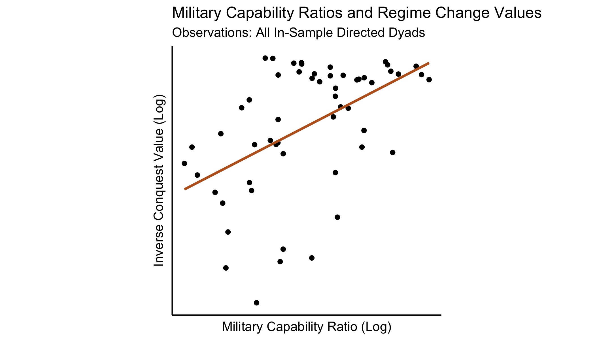

\newpage

# Introduction


Military power holds a central position in international relations (IR) theory. Governments exist in a state of anarchy — there is no world authority tasked with preventing the use of violence in settling policies disputes between them. As a result, powerful governments can employ force against others to secure more favorable policy outcomes. This does not necessarily imply that international relations are uniquely violent, however. Threatened governments can adjust their policy choices to accommodate the interests of the powerful, avoiding costly conflict [@Brito1985; @Fearon1995]. This setting raises an inference problem — do observed policies reflect the preferences of the governments that adopted them, or the military constraints of the anarchic international system?

In this paper, I propose and implement a method to assess the effect of military power on trade policy choices. Trade is a natural issue area in which undertake such an investigation. For a variety of reasons, governments' endeavor to protect their home market to some extent. Governments also seek access to foreign markets [@Grossman2016]. These preferences put governments into conflict with one another -- each would like to erect some barriers to imports while dismantling barriers to trade abroad. Given dictatorial power, governments would protect their home market and enforce openness elsewhere. Moreover, aggregate policy-induced trade frictions are large [@Cooley2019b] and have large effects on the distribution and level of welfare within and across countries [@Autor2013; @Costinot2015; @Goldberg2016]. These effects may be particularly salient for politically influential groups [@Grossman1994; @Osgood2017]. Governments therefore have incentives to use force to shape trade policy abroad to their liking. Historically, they have been willing to fight wars to realize such goals [@Findlay2007].

Assessing the effect of military power on trade policy requires imagining what policy choices governments would have made in the absence of coercion. In a coercion-free world, policies reflect preferences. If we observe policies, we can learn something about the preferences of the actors that adopted them. When coercion is possible, however, weaker governments must consider the effect of their policy choices on the powerful. If a particular policy choice harms a threatening government enough, it can choose to impose an alternative policy by force. Recognizing this threat, weaker governments adjust their policies to avoid war. In an anarchic world, policies may be determined by both power and preferences.  

I proceed in three steps to untangle power and preferences as determinants of trade policies. First, I model a coercive international political economy in which governments propose trade policies, observe others proposals, and choose whether or not to fight wars in bids to modify these. The model's equilibrium depends on a vector of parameters governing governments' preferences for protectionism and the effectiveness of military coercion. I then estimate these parameters by minimizing the distance between the model's predictions and observed policies. Finally, I answer the question posed here: how does military coercion affect trade policy? With estimates for the model's parameters in hand, this question can be answered by a simple counterfactual experiment — eliminate governments' military capacity, and recalculate the model's equilibrium. The difference between counterfactual equilibrium policies and the factual policies represents the net effect of military coercion on trade policy.

Within the coercive international political economy, governments choose trade policies to maximize a country-specific social welfare function. Each government's trade policy is a set of taxes, one for each importing country, imposed on imports. Notably, trade policies can be discriminatory, affecting certain source countries disproportionately. A model of the international economy connects trade policy choices to social welfare.^[The model of the international economy is a variant of the workhorse model of @Eaton2002. @Costinot2015 study a broader class of structural gravity models that connect trade frictions (such as trade policy) to trade and welfare outcomes.] Each government is endowed with military capacity which can be employed in wars against other governments. Winning a war allows the victor to choose the trade policy of the defeated government. Counterfactual wars constrain threatened governments and affect their trade policy choices. The effectiveness of coercion, or governments' ability to project power, depends on the geographic distance between potential adversaries.

Governments' ideal policies depend on a country-specific parameter governing the ease with which policy distortions are converted into revenues. Governments' ability to influence the choices of others depends on the effectiveness of power projection over geographic space and the returns to military power preponderance. Preferences and the shadow of power are difficult to measure. However, researchers do observe proxies of governments' total military strength (military spending) and their trade policy choices.^[I use data on aggregate directed trade policy distoritions from @Cooley2019b, a companion paper to this study. These data are discussed in more detail below.] The model maps military strength and power and preference parameters to policy choices. With information about total military strength, I show that the model can be inverted to recover parameters that best explain governments' policy choices. 

Within-country variation in trade policy identifies the model. Consider the ideal set of trade policies of a government whose preferences are known. The policies that achieve this objective can be readily calculated given knowledge of parameters governing international economic relations. Policies adopted toward imports from countries that pose no military threat will reflect this objective. Conversely, the imports of threatening countries will encounter lower barriers to trade, in order to satisfy the threatener's war constraint. This favoritism is informative about the effectiveness of military threats. The level of barriers toward non-threatening countries is informative about the government's preferences. Differential responses to the same level of threat from different geographic locations identifies parameters governing the effectiveness of power projection across space.

The identified model enables two classes of counterfactuals. First, it allows me to quantify the "shadow of power" by comparing factual policies to those that would prevail if governments' counterfactually possessed zero military capability. These policies can then be fed into the model of the international economy to calculate the effect on trade flows, prices, and wages around the world. Would different trade blocs emerge in a coercion-free world? Which governments would benefit the most? In the model, consumers benefit from the liberalizing effect of foreign military coercion [@Antras2011]. How large are these benefits? Whose citizens benefit the most from international power politics? How would relative changes to U.S. and Chinese military strength affect the international economy?

The model also allows me to examine how domestic political economic changes (changes to government preferences) affect the salience of military coercion. Governments that value the welfare of consumers prefer to adopt lower barriers to trade. The returns to coercing these governments are smaller, because their ideal policies impose relatively small externalities on potential threatening governments. Military coercion plays a smaller role in influencing trade policy when governments are relatively liberal. Domestic political institutions are believed to effect trade policy preferences [@Rodrik1995; @Milner1999; @Milner2005]. The model facilitates exploration of how domestic political change affects the quality of international relations and governments' propensity to threaten, display, and use military force against one another. 

## Literature


Conflicts of interest and the specter of coercive diplomacy emerge in the model due to governments' protectionist preferences. Trade theory reserves a role for small trade policy distortions for governments that seek to maximize aggregate societal wealth [@Johnson1953; @Broda2008]. Empirically, governments implement larger trade distortions than predicted in theory, however. This regularity motivated the study of the political economics of trade policy. While nearly free trade may be good for a society as a whole, owners of specific factors of production may prefer protectionism. If these groups have better access to the policymaking process, trade policy may be more protectionist than is optimal for society [@Mayer1984; @Rogowski1987; @Grossman1994]. A family of studies uses these theoretical insights to estimate governments' sensitivity to narrow versus diffuse interests [@Goldberg1999; @Mitra2006; @Gawande2009; @Gawande2012; @Ossa2014; @Gawande2015]. Because these models incorporate no theory of international military coercion, these estimates reflect the assumption that policy choices reflect the outcome of non-cooperative policy choice or non-militarized bargaining. Fiscal pressures might also drive protectionism. Some governments are constrained in their ability to raise revenue through taxes on domestic economic activities. Tariffs and other trade distortions may substitute as a revenue-raising strategy in these cases [@Rodrik2008; @Queralt2015]. 

I take no stance on the domestic political origins of protectionist preferences. I induce these by varying the ease with which governments can collect revenues from trade distortions. Each government is characterized by a revenue threshold parameter. Trade distoritions above the level of this threshold generate revenue while distortions below this level require subsidies. Governments with higher threshold parameters therefore prefer higher barriers to trade, all else equal. This simple formulation induces heterogeneity in the governments' ideal levels of protectionism and the magnitude of the externalities they would impose on other governments when choosing individually optimal policies.

These externalities motivate the lobbying efforts of domestic special interests and structure international negotiations over trade policy. In contemporary political economic accounts, large and productive firms pressure their own governments to secure market access abroad in order to increase profit opportunities [@Ossa2012; @Osgood2016; @Kim2017]. By contrast, in my model, lower barriers to trade abroad increase wages at home (helping consumers) and stimulate trade (increasing revenue). Therefore, regardless of their relative preference for consumer welfare versus rents, governments prefer to reduce barriers confronting their exports. Modeling government preferences in this manner captures market access incentives tractably while avoiding ascribing a particular domestic political process to their origin.

Because of these preferences for foreign trade liberalization, governments have incentives to influence others' policy choices. Analyzing governments' foreign policy in the 17th and 18th centuries, @Viner1948 concludes "important sources of national wealth...were available...only to countries with the ability to acquire or retain them by means of the possession and readiness to use military strength." Powerful governments established colonies and threatened independent governments in order to shape policy abroad to their liking [@Gallagher1953]. While formal empires died quickly after World War II, softer forms of influence remained. @Lake2013 terms the resulting order a "hierarchy" in which weaker countries exchanged sovereignty for international political order, provided by a hegemonic United States. @Berger2013 show that this hierarchy has not always been benevolent — U.S. political influence was used to open markets abroad, a form of "commercial imperialism." An earlier literature ascribed international economic openness to the presence of such a hegemon [@Krasner1976; @Gilpin1981; @Kindleberger1986]. In conceptualizing openness as a public good, these theories made stark predictions about the distribution of military power and the international economy. In reality, the benefits of changes to trade policy are quite excludable. The model developed here reflects this reality by allowing governments to adopt discriminatory trade policies. Power can therefore be exercised to secure benefits not shared by other governments. The resulting international economic orders defy characterization as "open" or "closed." In a stylized version of the model developed here, I show that latent regime change threats can be used to open foreign markets. Militarily weak countries adopt lower barriers to trade than their powerful counterparts, all else equal [@Cooley2019a]. @Antras2011 consider a similar model in which governments influence elections abroad. Again, this influence has a liberalizing effect on the foreign government's trade policy.

Nevertheless, debate persists about the efficacy of military power in achieving economic benefits [@Mastanduno2009; @Drezner2013; @Bove2014; @Stokes2017]. These studies all confront the inference problem discussed here — does economic policy reflect governments' underlying preferences or the shadow of foreign military power? When redistribution is an alternative to war and bargaining is frictionless, war is not necessary to achieve coercive effects [@Brito1985; @Fearon1995; @Art1996]. I assume that the effectiveness of military coercion depends on the geographic distance between a threatening and defending country. By examining the responsiveness of policy to foreign threats, I can quantify this relationship, providing estimates of the loss of strength gradient discussed in a body of quantitative studies on war and militarized interstate disputes [@Boulding1962; @BuenodeMesquita1980; @Diehl1985; @Lemke1995; @Gartzke2011].

Several studies have examined trade policy bargaining theoretically and empirically. @Grossman1995 extend the protection for sale model to a two-country bargaining setting. @Maggi1999 and @Bagwell1999 focus on the effect of the institutional context in which trade policy negotiations take place, relative to an un-institutionalized baseline. @Ossa2014, @Bagwell2018a and @Bagwell2018b quantify these theories in structural models. Of course, the continued functioning of international institutions requires either a) that complying with the rules of the institution be incentive compatible for each member state, given others' strategies or b) that an external authority punish deviations from the institutions' rules sufficiently to induce compliance [@Powell1994]. Given the absence of such an external authority and the stark international distributional implications of alternative trade policy regimes, it is natural to consider how the ability to employ military force colors trade policy bargaining. 

Trade and trade policy are often theorized as tools governments can leverage to achieve political objectives [@Hirschman1945; @Gowa1993; @Martin2012; @Seitz2015].  Yet, affecting trade policy and concomitant prices, wages, and trade flows is also a central government objective in international relations. Moreover, the political objectives that ostensibly motivate governments in these "trade as means" models are loosely defined (e.g. "security") and themselves means to achieving other ends. Studying trade policy as a strategic end allows the analyst to leverage a family of empirical methods in international economics to construct counterfactual trade regimes and analyze their welfare implications [@Eaton2002; @Head2014; @Costinot2015; @Ossa2016]. Government objectives can be defined flexibly as a function of general equilibrium outputs (prices, wages, revenues).

A handful of other theoretical studies examine how power affects exchange in market environments [@Skaperdas2001; @Piccione2007; @Garfinkel2011; @Carroll2018]. Where property rights are assumed in classical models of the economy, these authors consider exchange and violence as coequal means to acquire goods from others. I instead direct attention to coercive bargaining over endogenous trade frictions (trade policy). These in turn affect the distribution of goods and welfare in the international economy.

# Data and Calibration of Economy


I estimate the model on a set of 9 governments in the year 2011.^[Focusing on a small set of governments is necessary for computational tractability. However, the largest countries (by GDP) are the most attractive targets for coercion, as changes to their trade policies return the largest welfare gains.] These governments are listed in Table \ref{tab:ccodes}. I aggregate all European Union governments into a single entity and collapse all countries not included in the analysis into a "Rest of World" (ROW) aggregate.^[Such an aggregation is necessary in order to calculate fully general equilibrium effects of counterfactual trade policies. However, I prohibit other countries from invading ROW and likewise prohibit ROW from invading others. This ensures that estimates of military parameters depend almost entirely on interactions between countries within my sample.] Non-ROW countries make up 72 percent of world GDP.

\begin{table}

\caption{\label{tab:ccodes}In-Sample Countries \label{tab:ccodes}}
\centering
\begin{tabular}[t]{ll}
\toprule
iso3 & Country Name\\
\midrule
\rowcolor{gray!6}  AUS & Australia\\
CAN & Canada\\
\rowcolor{gray!6}  CHN & China\\
EU & European Union\\
\rowcolor{gray!6}  JPN & Japan\\
\addlinespace
KOR & South Korea\\
\rowcolor{gray!6}  RoW & Rest of World\\
RUS & Russia\\
\rowcolor{gray!6}  USA & United States\\
\bottomrule
\end{tabular}
\end{table}

Estimating the model and conducting the subsequent counterfactual exercises require knowledge of governments' trade policies, disaggregated at the directed dyadic level. While detailed data on a particular policy instrument (tariffs) are available to researchers, these are but one barrier governments can use to influence the flow of trade. In a companion paper [@Cooley2019b], I show how to measure aggregate directed trade policy distortions given data on national accounts (gross consumption, gross production, and gross domestic product), price levels, trade flows, and freight costs. This method produces a matrix of trade barriers, in which the $i$, $j$th entry is the magnitude of policy barriers to trade an importing country $i$ imposes on goods from an exporting country $j$. In 2011, the estimated barriers were large, equivalent to a 81 percent import tariff on average.^[These results and the calibration choices that produce this value are discussed in more detail in Appendix B.] They also reveal substantial trade policy discrimination, with a subset of developed exporters facing far more favorable market access conditions than their less-developed peer countries. 

I take these estimated trade policies as the equilibrium output of the model developed here. I assume these policies are measured with error and construct an estimator that minimizes the magnitude of the resulting error vector. I sample from bootstrapped iterations of the trade policy estimation routine and re-compute parameter estimates many times in order to construct confidence intervals around my point estimates. 

Estimating the magnitude of these trade policies and tracing their impact government welfare requires specifying a model of the international economy. This model, which follows closely that of @Eaton2002, can be represented succinctly as a mapping $h(\bm{\tau}, \bm{Z}_h; \bm{\theta}_h) \rightarrow \bm{w}$ where $\bm{\tau}$ is a vector of trade policies, $\bm{Z}_h$ is a vector of economic data (including information on national accounts, price levels, trade flows, and freight costs), and $\bm{\theta}_h$ is a vector of parameters to be calibrated to match empirical analogues. $\bm{w}$ is a vector of wage levels, one for every country, from which equilibrium trade flows and price levels can be calculated. Government welfare is modeled below as a function of the outputs of this economy. I employ the same model of the international economy used to estimate trade policies in @Cooley2019b to calculate the welfare effects of trade policies in this study. The economy, the data required to calibrate it, and the parameter calibration choices I employ are discussed in more detail in Appendix B.

In the coercive political economy developed below, governments' relative directed war costs are modeled as a function of the military capability ratio between the attacker and defender, the geographic distance between the belligerents, and the gross domestic product of the attacking country. I store these observable features in the vector $\bm{Z}$. To measure military capability ratios, I employ [SIPRI](https://www.sipri.org/)'s data on military expenditure to measure governments' military capacity. These values are displayed in Figure \ref{fig:milex}. I use data from @Weidmann2010 to calculate centroid-centroid geographic distance between all countries in my sample. Data on gross domestic production comes from the [World Input-Output Database (WIOD)](http://www.wiod.org/home) [@Timmer2015]. 


## Reduced Form Evidence on Coercion and Trade Policy

To assist in the interpretation of the following results, consider a simple bilateral coercive bargaining setting. Governments 1 and 2 bargain over a pie of size 1. Let $x \in [0, 1]$ denote the share of the pie awarded to government 1 (with the remainder, $1-x$, going to government 2). In the trade setting studied here, $x=1$ might correspond to government 1 implementing optimal tariffs and government 2 liberalizing fully. Each government's valuation of the pie is given by an increasing, weakly concave utility function $u_i(x)$. The value of each government's outside option is given by a war function, $w_i(M_i / M_j)$, which depends on their relative military capabilities, $\frac{M_i}{M_j}$. Assume $w_i$ is increasing in this military capability ratio -- that is, more powerful governments enjoy better outside options.

For simplicity, assume the pie is divided via the Nash Bargaining Solution, satisfying
\begin{equation}
\begin{split}
x^\star \in \argmax_x & \quad \left( u_1(x) - w_1(M_1 / M_2) \right) \left( u_2(x) - w_2(M_2 / M_1) \right) \\
\text{subject to} & \quad u_1(x) \geq w_1(M_1 / M_2) \\
& \quad u_2(x) \geq w_2(M_2 / M_1) .
\end{split}
\end{equation}
Taking first order conditions, it is straightforward to show that the allocation to government 1, $x^\star$, satisfies
$$
u_1^\star(x^\star; M_1, M_2) = \frac{u_1^\prime(x^\star)}{u_2^\prime(1 - x^\star)} \left( u_2(1 - x^\star) - w_2(M_2 / M_1) \right) + w_1(M_1 / M_2) . 
$$
Differentiating this equation with respect to government 1's military capacity, $M_1$, we see that $u_1(x^\star; M_1, M_2)$ is increasing in $M_1$,
$$
\frac{\partial u_1^\star(x^\star; M_1, M_2) }{\partial M_1} = \underbrace{- \frac{u_1^\prime(x^\star)}{u_2^\prime(1 - x^\star)} \frac{\partial w_2(M_2 / M_1)}{\partial M_1}}_{>0} + \underbrace{\frac{\partial w_1(M_1 / M_2)}{ \partial M_1}}_{>0} > 0 .
$$
In other words, the distance between government 1's equilibrium utility and the utility it receives at it's ideal point id decreasing in it's relative military advantage.

Suppose that governments endeavor to maximize the welfare of the representative consumer.^[I will relax this assumption in the structural model developed below.] With the economy, $h$, calibrated, I can calculate the change in utility each representative consumer would experience when every other government adopts free trade, relative to their utility at the baseline set of policies. Taking this as a empirical measure of the ratio $u_1^\star(x^\star; M_1, M_2) / u_1(1)$, the model implies this quantity will be increasing in $M_1$, country 1's military capacity. I will refer to this quantity as government 1's inverse *conquest value* vis-à-vis government 2.



Figure \ref{fig:rcvm} plots the empirical relationship between military capability ratios and inverse regime change values. A potential "attacking" country's military capability ratio vis a vis every "defending" country is plotted on the x-axis. On the y-axis is the attacking country's value for conquering each defending country. Consistent with the predictions of this simple model, government's inverse conquest values correlate positively with their relative military power. Table \ref{fig:rcvm_reg_tex} and Figure \ref{fig:rcvm_reg_dw} display the results of a series of linear models that estimate the conditional correlations between the inverse conquest value and the military capability ratio, distance between the countries, and country-specific factors. 

\begin{table}

\caption{\label{tab:rcvm}Inverse Conquest Values and Military Capability Ratios}
\centering
\resizebox{\linewidth}{!}{
\begin{tabular}[t]{lllll}
\toprule
        & Base & Base (Attacker FE) & Loss of Strength & Loss of Strength (Attacker FE)\\
\midrule
Log Mil Capability Ratio & 0.016*** & 0.033*** & 0.026 & 0.045\\
 & (0.004) & (0.004) & (0.052) & (0.039)\\
Log Distance &  &  & 0.003 & 0.002\\
 &  &  & (0.010) & (0.008)\\
(Log Mil Capability Ratio) X (Log Distance) &  &  & -0.001 & -0.001\\
 &  &  & (0.006) & (0.004)\\
\midrule
Num.Obs. & 56 & 56 & 56 & 56\\
R2 & 0.247 & 0.676 & 0.249 & 0.677\\
R2 Adj. & 0.233 & 0.621 & 0.205 & 0.605\\
Attacker FE? &  & ✓ &  & ✓\\
\bottomrule
\multicolumn{5}{l}{\textsuperscript{} * p < 0.1, ** p < 0.05, *** p < 0.01}\\
\end{tabular}}
\end{table}


The first model confirms the statistical significance of the correlation shown in Figure \ref{fig:rcvm}. The second model estimates this correlation within potential "attacking" countries. Here, inverse conquest values continue to rise as military advantage rises. The final two models interact the military capability ratio with a measure of distance between the attacker and defender. The estimated correlation between military capbility is not attenuated, but does lose statistical significance in these specifications. Distance and the interaction of distance with military capability does not covary with the inverse conquest values, whether or not country-specific factors are included. These raw correlations are informative about the role of coercion in the formation of trade policy but suggestive at best. Trade policy bargaining is a multilateral endeavor in which third party externalities loom large. Moreover, governments may vary in their preferences for protectionism, changing their ideal policies and their valuations for conquering others. The model developed below accounts explicitly for these features of trade policy bargaining, delivering interpretable estimates of the effects of military capability and geographic distance on trade policy outcomes.


# Model

<!-- ```{r, child = paste0(sections_dir, "model.md")}
```
 -->

# Estimation

<!-- ```{r, child = paste0(sections_dir, "estimation.rmd")}
``` -->

# Results

<!-- ```{r, child = paste0(sections_dir, "results.rmd")}
``` -->

# Counterfactual: Coercion-Free World

<!-- ```{r, child = paste0(sections_dir, "counterfactuals.rmd")}
``` -->


# Conclusion

<!-- ```{r, child = paste0(sections_dir, "conclusion.md")}
``` -->

\clearpage

# Appendix

<!-- ```{r Appendix Numbering, echo=FALSE, warning=FALSE, message=FALSE, results='hide'}

a <- 1

# reset definition, assumption, proposition, lemma tickers
Dtick <- 1
Atick <- 1
Ptick <- 1
Ltick <- 1

Aeconomy <- LETTERS[a]
``` -->

## A: Economy

<!-- ```{r, child = paste0(sections_dir, "Aeconomy.md")}
```


```
## Error: attempt to use zero-length variable name
```

